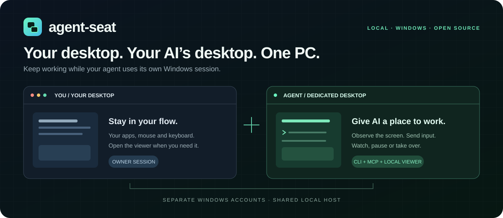
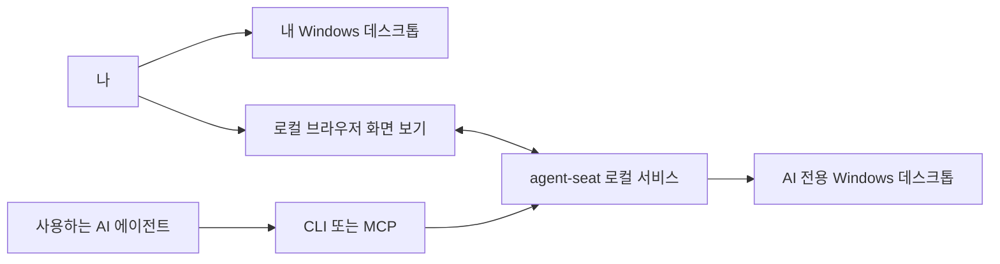

<div align="center">



**AI에게 전용 Windows 좌석을 주고, 내 데스크톱은 계속 사용하세요.**

[English](README.md) · [한국어](README.ko.md) · [简体中文](README.zh-CN.md)

[](https://github.com/aksmfosef11/agent-seat/releases)
[](#지원-환경)
[](#언어)
[](LICENSE)

[다운로드](https://github.com/aksmfosef11/agent-seat/releases) · [설치·복구](docs/INSTALL.md) · [CLI / MCP](#ai-연결) · [보안](SECURITY.md)

</div>

## 왜 agent-seat인가요?

AI에게 앱을 열고, 화면을 읽고, 데스크톱 작업을 수행할 공간이 필요합니다. 그동안 나도 컴퓨터를 계속 쓸 수 있어야 합니다.

**agent-seat는 AI를 위한 별도 Windows 계정과 데스크톱 세션을 만듭니다.** AI는 그 좌석에서 작업하고, 나는 내 세션에서 컴퓨터를 사용합니다. 필요할 때 로컬 화면 보기 창을 열어 진행 상황을 확인하고, 대시보드에서 입력을 일시정지하거나 마우스·키보드로 직접 조작할 수 있습니다.

기존 AI 에이전트에 Windows 작업 공간을 연결하거나, 앱 자동화를 실험하거나, AI 화면을 계속 앞에 띄워 두지 않고 작업을 감독할 때 사용할 수 있습니다. 이 프로젝트는 좌석과 조작 도구를 제공합니다. 이미지를 읽고 도구를 호출할 AI 에이전트나 모델 클라이언트는 사용자가 연결합니다.

> **0.9.1 시험판입니다.** Windows 클라이언트의 동시 세션을 위해 비공식 TermWrap 수정을 사용합니다. Windows 업데이트로 호환성이 바뀔 수 있습니다. 다양한 Windows 빌드의 새 PC 설치와 재부팅·재로그인 검증은 남아 있습니다. 설치 전 [검증 기록](docs/VALIDATION.md)을 확인하세요.

## 주요 기능

| 기능 | 사용할 수 있는 것 |
| --- | --- |
| 🖥️ 전용 데스크톱 | 별도 표준 Windows 계정과 독립된 대화형 세션 |
| 👀 로컬 화면 보기 | 브라우저에서 AI 화면 확인, 읽기 전용으로 시작 |
| 🖱️ 직접 조작 | 클릭·더블 클릭·오른쪽 클릭·드래그·휠·키 입력·IME 텍스트 |
| 🧰 CLI와 선택 사항인 MCP | 기존 에이전트에서 원하는 방식으로 연결 |
| 📝 필요한 관찰만 전달 | UI 텍스트, 동일 화면 감지, 변경 영역 이미지 |
| ⏸️ 소유자 제어 | 로컬 대시보드에서 일시정지·재개·입력 중지 |
| 🌐 세 언어 | 한국어·영어·중국어 간체, 선택한 언어 저장 |

배포 ZIP에는 서비스, CLI, RDP 앵커, 입력 도우미와 .NET 런타임이 들어 있습니다.

## 동작 구조



*상단 배너는 개념도입니다. 두 데스크톱은 한 Windows 호스트를 공유합니다. 계정과 세션 분리는 가상머신이나 보안 샌드박스를 의미하지 않습니다.*

## 빠른 시작

### 더블 클릭 설치

[Install-AgentSeat.cmd 다운로드](https://github.com/aksmfosef11/agent-seat/releases/download/v0.9.1/Install-AgentSeat.cmd) 후 더블 클릭하세요. 실행 파일 ZIP 다운로드, SHA-256 체크섬과 GitHub 파일 해시 확인, 압축 해제, 설치 시작까지 자동으로 진행합니다. 직접 압축을 풀거나 개발 도구를 설치할 필요가 없습니다.

설치 계획을 확인하고 **INSTALL**을 입력해 비공식 Windows 클라이언트 수정에 동의한 뒤, 같은 Windows 소유자 계정으로 관리자 승인창을 확인하세요. 설치가 끝나면 좌석 화면이 읽기 전용으로 열립니다.

### PowerShell 한 줄 설치

일반 소유자 계정에서 **64비트 Windows PowerShell**을 열고 실행하세요.

```powershell
& ([scriptblock]::Create((irm 'https://raw.githubusercontent.com/aksmfosef11/agent-seat/v0.9.1/Get-AgentSeat.ps1')))
```

이 명령은 이 저장소의 버전이 지정된 [설치 시작 스크립트](Get-AgentSeat.ps1)를 내려받아 실행합니다. 같은 설치 계획과 관리자 승인 과정이 이어집니다. 설치 파일을 실행하기 전에 ZIP을 검증합니다.

### ZIP으로 오프라인 설치

[Releases](https://github.com/aksmfosef11/agent-seat/releases)에서 **`agent-seat-0.9.1-win-x64.zip`**과 **`SHA256SUMS.txt`**를 받아 해시를 비교합니다. ZIP 압축을 풀고 안의 **`Install-AgentSeat.cmd`**를 더블 클릭하면 추가 다운로드 없이 설치합니다.

```powershell
Get-FileHash .\agent-seat-0.9.1-win-x64.zip -Algorithm SHA256
```

GitHub가 자동 생성하는 소스 코드 압축 파일에는 실행 파일이 없습니다. 일반 사용자는 Visual Studio, Node.js, Git, .NET SDK를 설치할 필요가 없습니다.

이미 설치된 좌석에서는 계정을 다시 만들거나 비밀번호를 바꾸지 않고 화면을 엽니다. 기존 실행 파일을 업데이트하는 기능은 없습니다. 옵션, 다운로드만 하기, 중간 실패 복구는 [설치 안내](docs/INSTALL.md)를 참고하세요.

설치 후에는 **`View-Seat.cmd`**로 화면을 다시 열 수 있습니다. AI 작업을 멈춘 뒤 **직접 조작**을 켜세요. IME 입력은 텍스트 입력칸을, 브라우저가 먼저 처리하는 키 조합은 단축키 버튼을 사용하세요.

## 지원 환경

| 항목 | 시험판 지원 범위 |
| --- | --- |
| 호스트 | Windows 11 Pro / Enterprise / Education, x64 |
| 설치 | 현재 로그인한 소유자의 관리자 권한 |
| AI 클라이언트 | 이미지를 읽고 CLI 또는 MCP 도구를 호출할 수 있는 에이전트 |
| 런타임 | ZIP에 포함된 .NET 8.0.31 |
| 자동 설치 미지원 | Windows Home, ARM64, Windows Server/RDS |

앵커는 설치한 소유자 계정에서 실행됩니다. 소유자가 로그아웃 후 다시 로그인하면 `computer start`로 좌석을 시작하세요. 중간 설치 실패와 Windows 업데이트 대응은 [설치·복구 안내](docs/INSTALL.md)를 확인하세요.

## AI 연결

### CLI

MCP 없이 CLI만으로도 사용할 수 있습니다. 설치한 소유자 계정의 CLI가 보호된 토큰을 자동으로 읽습니다.

```powershell
$cli = "$env:ProgramFiles\agent-seat\cli\agent-seat.exe"
& $cli computer start --seat agent
& $cli computer begin --seat agent
& $cli computer guide
```

`begin`으로 새 관찰 문맥을 만들고 반환된 화면 이미지를 연 뒤, 이후 관찰과 행동에 같은 문맥 ID를 사용합니다. 입력을 배치로 묶을 수 있으며, 실패한 행동을 다시 보내기 전에는 결과를 확인하세요. [CLI 사용 안내](docs/AGENT-USAGE.md)에 자세한 흐름이 있습니다.

### MCP

같은 실행 파일을 인자 `computer mcp --seat agent`와 함께 MCP 클라이언트에 등록합니다. `seat_status`, `seat_start`, `seat_observe`, `seat_act` 네 도구를 제공하고, 이미지도 도구 결과로 바로 돌려줍니다. [MCP 설정 안내](docs/AGENT-MCP.md)를 참고하세요.

**토큰 사용량:** UI 텍스트, 이미지 재사용, 변경 영역과 행동 배치는 반복 관찰을 줄일 수 있습니다. 효과는 모델과 작업에 따라 달라지며 특정 절감률을 보장하지 않습니다. 사람용 화면 보기는 모델 API를 호출하거나 모델에 프레임을 보내지 않습니다.

## 언어

대시보드와 화면 보기 창에서 **한국어 · English · 中文（简体）**를 지원합니다. 처음에는 브라우저의 선호 언어를 따르고, 미지원 언어는 영어로 표시합니다. 헤더나 화면 보기 창의 언어 선택으로 바꾸면 해당 브라우저에 저장됩니다. 페이지를 새로고침하거나 작성 중인 텍스트를 지우지 않습니다.

agent-seat UI 언어만 바뀝니다. 좌석 안의 Windows와 앱 언어는 그대로입니다. CLI/API의 기계용 메시지와 진단 원문은 호환성을 위해 영어를 유지합니다. 알 수 없는 공급자 진단을 추측해서 번역하거나 숨기지 않습니다.

## 빌드와 기여

개발에는 Git, .NET 8 SDK, **C++를 사용한 데스크톱 개발** 및 Windows SDK가 설치된 Visual Studio/Build Tools가 필요합니다. UI 테스트에는 Node.js를 사용합니다.

```powershell
git clone https://github.com/aksmfosef11/agent-seat.git
cd agent-seat
.\scripts\Build-TermWrap.ps1
dotnet test .\AgentSeat.sln -c Release
npm test
powershell -NoProfile -File tests/installer/bootstrap.tests.ps1
.\scripts\Package-Release.ps1
```

배포를 묶기 전에 소스 변경을 커밋하세요. 릴리스는 소스 커밋을 기록합니다. 빌드 파일과 로컬 자격증명은 Git에서 제외됩니다. [릴리스 절차](docs/RELEASING.md)와 [다국어 관리](docs/LOCALIZATION.md)를 참고하세요.

[이슈](https://github.com/aksmfosef11/agent-seat/issues)에는 Windows 에디션·빌드와 재현 절차를 적어 주세요. 토큰, 자격증명, 개인 화면은 제거하세요. 안정 버전을 위한 새 PC 설치·재로그인 검증도 환영합니다.

## 문서

| 안내 | English | 한국어 | 简体中文 |
| --- | --- | --- | --- |
| 프로젝트 소개 | [README](README.md) | [README](README.ko.md) | [README](README.zh-CN.md) |
| 설치·복구 | [Guide](docs/en/INSTALL.md) | [안내](docs/INSTALL.md) | [指南](docs/zh-CN/INSTALL.md) |
| CLI | [Guide](docs/en/AGENT-USAGE.md) | [안내](docs/AGENT-USAGE.md) | [指南](docs/zh-CN/AGENT-USAGE.md) |
| 선택 사항인 MCP | [Guide](docs/en/AGENT-MCP.md) | [안내](docs/AGENT-MCP.md) | [指南](docs/zh-CN/AGENT-MCP.md) |

[보안](SECURITY.md) · [검증 기록](docs/VALIDATION.md) · [구조](docs/AGENT-CONTROL.md)

## 라이선스

프로젝트 소스는 [MIT](LICENSE)입니다. 의존성은 원래 라이선스를 유지합니다. [서드파티 고지](THIRD_PARTY_NOTICES.md)를 확인하세요.
