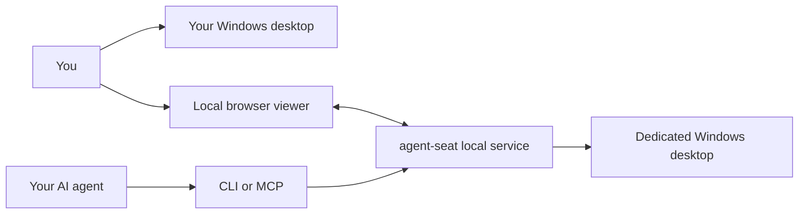

<div align="center">


**Give your AI a Windows desktop. Keep using yours.**

[English](README.md) · [한국어](README.ko.md) · [简体中文](README.zh-CN.md)

[](https://github.com/aksmfosef11/agent-seat/releases)
[](#requirements)
[](#languages)
[](LICENSE)

[Download](https://github.com/aksmfosef11/agent-seat/releases) · [Install & recovery](docs/en/INSTALL.md) · [CLI / MCP](#connect-your-agent) · [Security](SECURITY.md)

</div>

## Why agent-seat?

Your agent needs a place to open apps, read screens and carry out desktop tasks. You still need a computer you can use.

**agent-seat creates a separate local Windows account and desktop session for your AI.** Your agent works in that session while you keep using your own. Open the local viewer to see its progress, pause input or take over with your mouse and keyboard.

Use it to give an existing AI agent a desktop workspace, explore Windows app automation, or supervise a task without keeping the AI's screen in the foreground. The project provides the desktop and control tools; bring your own image-capable agent or model client.

> **Experimental preview · 0.9.1.** The installer uses an unsupported TermWrap modification to enable simultaneous sessions on Windows clients. Windows updates can affect compatibility. Fresh-machine installation across Windows builds and restart/re-login are still unvalidated. Review the [validation record](docs/VALIDATION.md) before installing.

## What you can do

| Capability | What it gives you |
| --- | --- |
| 🖥️ Dedicated desktop | A standard Windows account and its own interactive session |
| 👀 Local viewer | See the AI's desktop in a browser; starts read-only |
| 🖱️ Human takeover | Click, double-click, right-click, drag, scroll, send keys and IME text |
| 🧰 CLI + optional MCP | Connect your existing agent through either interface |
| 📝 Selective observations | UI text, unchanged-frame detection and changed-region crops |
| ⏸️ Owner controls | Pause, resume and stop input from the local dashboard |
| 🌐 Three UI languages | English, Korean and Simplified Chinese with a saved language choice |

The release includes the service, CLI, RDP anchor, input helper and .NET runtime.

## How it fits together



*The banner is a conceptual illustration. Both desktops share one Windows host. Separate accounts and sessions are not a VM or security sandbox.*

## Quick start

### Double-click installation

[Download Install-AgentSeat.cmd](https://github.com/aksmfosef11/agent-seat/releases/download/v0.9.1/Install-AgentSeat.cmd) and double-click it. It downloads the executable release ZIP, verifies its SHA-256 checksum and GitHub asset digest, extracts it and starts setup. No manual extraction or developer tools are needed.

Review the installation plan, type **INSTALL** to accept the unsupported Windows client modification, then approve Windows administrator access using the same owner account. Setup creates the seat and opens its screen read-only.

### One PowerShell command

Open **64-bit Windows PowerShell** under your ordinary installing owner account and run:

```powershell
& ([scriptblock]::Create((irm 'https://raw.githubusercontent.com/aksmfosef11/agent-seat/v0.9.1/Get-AgentSeat.ps1')))
```

This downloads and executes the versioned [bootstrap script](Get-AgentSeat.ps1) from this repository. The same installation review and Windows administrator prompt follow. The bootstrap checks the ZIP before running its installer.

### Offline ZIP installation

Download **`agent-seat-0.9.1-win-x64.zip`** and **`SHA256SUMS.txt`** from [Releases](https://github.com/aksmfosef11/agent-seat/releases), compare the hash, then extract the ZIP and double-click its **`Install-AgentSeat.cmd`**. This path uses the local package without another download.

```powershell
Get-FileHash .\agent-seat-0.9.1-win-x64.zip -Algorithm SHA256
```

GitHub's automatic source archives do not contain built applications. End users do not need Visual Studio, Node.js, Git or a .NET SDK.

Setup reuses an existing seat and opens its viewer; it does not reset accounts or upgrade existing application binaries. See [installation and recovery](docs/en/INSTALL.md) for options, download-only mode and interrupted installations.

After setup, **`View-Seat.cmd`** opens the screen again. Stop the AI task before enabling **Manual control**. Use the text box for IME text and the shortcut buttons for combinations intercepted by the browser.

## Requirements

| Item | Preview support |
| --- | --- |
| Host | Windows 11 Pro / Enterprise / Education, x64 |
| Installation | Administrator access from the interactive owner's account |
| AI client | Your own agent that can read images and call CLI or MCP tools |
| Runtime | Included in the release ZIP (.NET 8.0.31) |
| Unsupported installers | Windows Home, ARM64 and Windows Server/RDS |

The anchor runs under the installing owner. After logging out and back in, start the seat again with `computer start`. Review [recovery and current limitations](docs/en/INSTALL.md) for interrupted installations and Windows updates.

## Connect your agent

### CLI

MCP is optional. The CLI reads the protected token for the installing owner:

```powershell
$cli = "$env:ProgramFiles\agent-seat\cli\agent-seat.exe"
& $cli computer start --seat agent
& $cli computer begin --seat agent
& $cli computer guide
```

Start a new observation context with `begin`, open its returned screenshot, then reuse its context ID for subsequent observations and actions. Input can be batched; observe the result before retrying a failed action. See the [English CLI workflow](docs/en/AGENT-USAGE.md).

### MCP

Register the same executable with arguments `computer mcp --seat agent` in your MCP client. Four tools are available: `seat_status`, `seat_start`, `seat_observe` and `seat_act`. Images can be returned directly in tool results. See [MCP setup](docs/en/AGENT-MCP.md).

**Token usage:** UI text, image reuse, crops and batches can reduce repeated observations. Savings depend on the model and task; no percentage is promised. The human viewer itself sends no frames to a model and makes no model API calls.

## Languages

The dashboard and viewer support **English · 한국어 · 中文（简体）**. The first visit follows your browser's preferred languages; unsupported languages fall back to English. Use the language selector in the header or viewer to change it. Your choice is saved in that browser without reloading the page or clearing drafted text.

This changes agent-seat's interface, not the Windows language or the apps inside the seat. CLI/API machine messages and original diagnostics stay in English for compatibility. Unknown provider diagnostics remain available rather than being guessed or hidden.

## Build and contribute

Developers need Git, .NET 8 SDK, Visual Studio/Build Tools with **Desktop development with C++** and the Windows SDK. Node.js is needed for UI tests.

```powershell
git clone https://github.com/aksmfosef11/agent-seat.git
cd agent-seat
.\scripts\Build-TermWrap.ps1
dotnet test .\AgentSeat.sln -c Release
npm test
powershell -NoProfile -File tests/installer/bootstrap.tests.ps1
.\scripts\Package-Release.ps1
```

Commit source changes before packaging; the release records its source commit. Generated binaries and local credentials stay out of Git. See [releasing](docs/RELEASING.md) and [localization](docs/LOCALIZATION.md).

Reports with a Windows edition/build and clear reproduction steps help most. Remove tokens, credentials and personal screenshots before opening an [issue](https://github.com/aksmfosef11/agent-seat/issues). Fresh-install and re-login testing are especially useful before a stable release.

## Documentation

| Guide | English | 한국어 | 简体中文 |
| --- | --- | --- | --- |
| Project overview | [README](README.md) | [README](README.ko.md) | [README](README.zh-CN.md) |
| Install & recovery | [Guide](docs/en/INSTALL.md) | [안내](docs/INSTALL.md) | [指南](docs/zh-CN/INSTALL.md) |
| CLI workflow | [Guide](docs/en/AGENT-USAGE.md) | [안내](docs/AGENT-USAGE.md) | [指南](docs/zh-CN/AGENT-USAGE.md) |
| Optional MCP | [Guide](docs/en/AGENT-MCP.md) | [안내](docs/AGENT-MCP.md) | [指南](docs/zh-CN/AGENT-MCP.md) |

[Security](SECURITY.md) · [Validation](docs/VALIDATION.md) · [Architecture](docs/AGENT-CONTROL.md)

## License

[MIT](LICENSE) for this project's source. Dependencies retain their original licenses; see [third-party notices](THIRD_PARTY_NOTICES.md).
