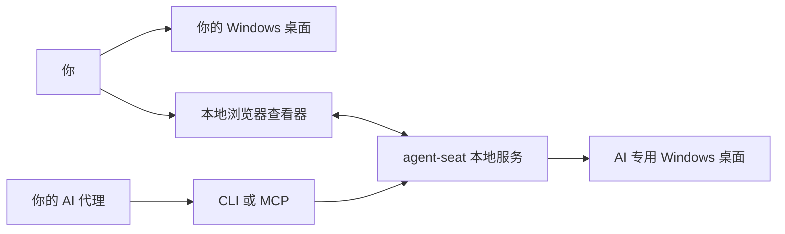

<div align="center">


**给 AI 一个 Windows 桌面，自己的桌面继续用。**

[English](README.md) · [한국어](README.ko.md) · [简体中文](README.zh-CN.md)

[](https://github.com/aksmfosef11/agent-seat/releases)
[](#系统要求)
[](#语言)
[](LICENSE)

[下载](https://github.com/aksmfosef11/agent-seat/releases) · [安装与恢复](docs/zh-CN/INSTALL.md) · [CLI / MCP](#连接你的代理) · [安全说明](SECURITY.md)

</div>

## 为什么使用 agent-seat？

AI 需要一个打开应用、读取屏幕并执行桌面任务的工作空间。同时，你也需要继续使用自己的电脑。

**agent-seat 为 AI 创建独立的本地 Windows 账户和桌面会话。** AI 在专用席位中工作，你继续使用自己的会话。需要时可以打开本地查看器检查进度，在仪表板暂停输入，或通过鼠标和键盘接管操作。

你可以为现有 AI 代理提供 Windows 工作空间、探索应用自动化，或在不持续显示 AI 屏幕的情况下监督任务。本项目提供桌面和操作工具；能够读取图像并调用工具的代理或模型客户端由你自行连接。

> **0.9.0 实验预览版。** 安装器使用非官方 TermWrap 修改来启用 Windows 客户端的并发会话。Windows 更新可能影响兼容性。不同 Windows 版本的新机器安装、重启及重新登录仍未完成验证。安装前请查看[验证记录](docs/VALIDATION.md)。

## 主要功能

| 功能 | 可以获得什么 |
| --- | --- |
| 🖥️ 专用桌面 | 独立的标准 Windows 账户及交互会话 |
| 👀 本地查看器 | 在浏览器中查看 AI 桌面，默认只读 |
| 🖱️ 手动接管 | 单击、双击、右键、拖动、滚动、键盘及输入法文本 |
| 🧰 CLI 与可选 MCP | 通过任意一种接口连接现有代理 |
| 📝 按需观察 | UI 文本、未变化画面检测及变化区域截图 |
| ⏸️ 所有者控制 | 在本地仪表板暂停、恢复或停止输入 |
| 🌐 三种界面语言 | 英语、韩语、简体中文，记住所选语言 |

发行 ZIP 包含服务、CLI、RDP 锚点、输入助手及 .NET 运行时。

## 工作方式



*顶部横幅为概念示意图。两个桌面共享一台 Windows 主机。独立账户和会话不等同于虚拟机或安全沙箱。*

## 快速开始

### 双击安装

[下载 Install-AgentSeat.cmd](https://github.com/aksmfosef11/agent-seat/releases/download/v0.9.0/Install-AgentSeat.cmd)，然后双击。它会下载可执行 ZIP，验证 SHA-256 校验和与 GitHub 文件摘要，解压并启动安装。无需手动解压或安装开发工具。

查看安装计划，输入 **INSTALL** 接受非官方 Windows 客户端修改，然后使用同一 Windows 所有者账户确认管理员授权。安装完成后，席位查看器会以只读模式打开。

### 一条 PowerShell 命令

使用普通所有者账户打开 **64 位 Windows PowerShell**，运行：

```powershell
& ([scriptblock]::Create((irm 'https://raw.githubusercontent.com/aksmfosef11/agent-seat/v0.9.0/Get-AgentSeat.ps1')))
```

此命令下载并执行本仓库的指定版本[引导脚本](Get-AgentSeat.ps1)，随后显示相同的安装计划及管理员授权提示。引导脚本会先验证 ZIP，再运行安装器。

### ZIP 离线安装

从 [Releases](https://github.com/aksmfosef11/agent-seat/releases) 下载 **`agent-seat-0.9.0-win-x64.zip`** 和 **`SHA256SUMS.txt`**，对比哈希，解压 ZIP 后双击其中的 **`Install-AgentSeat.cmd`**。此方式使用本地文件，不会再次下载。

```powershell
Get-FileHash .\agent-seat-0.9.0-win-x64.zip -Algorithm SHA256
```

GitHub 自动生成的源码压缩包不包含可执行程序。普通用户无需安装 Visual Studio、Node.js、Git 或 .NET SDK。

已安装的席位会被复用并打开查看器，不会重建账户、重置密码或更新现有程序文件。参数、仅下载模式及失败恢复请查看[安装说明](docs/zh-CN/INSTALL.md)。

安装后可用 **`View-Seat.cmd`** 再次打开屏幕。先停止 AI 任务，再启用**手动操作**。输入法文本使用文本框；浏览器拦截的组合键使用快捷键按钮。

## 系统要求

| 项目 | 预览版支持范围 |
| --- | --- |
| 主机 | Windows 11 Pro / Enterprise / Education，x64 |
| 安装 | 当前交互登录的所有者账户具有管理员权限 |
| AI 客户端 | 能够读取图像并调用 CLI 或 MCP 工具的代理 |
| 运行时 | ZIP 中已包含 .NET 8.0.31 |
| 不支持自动安装 | Windows Home、ARM64、Windows Server/RDS |

锚点在安装时的所有者账户下运行。注销并重新登录后，请使用 `computer start` 启动席位。安装中断及 Windows 更新相关问题请查看[安装与恢复](docs/zh-CN/INSTALL.md)。

## 连接你的代理

### CLI

MCP 不是必需的。CLI 会为安装时的所有者读取受保护的令牌。

```powershell
$cli = "$env:ProgramFiles\agent-seat\cli\agent-seat.exe"
& $cli computer start --seat agent
& $cli computer begin --seat agent
& $cli computer guide
```

使用 `begin` 创建新的观察上下文，打开返回的截图，然后在后续观察和操作中复用上下文 ID。可以批量发送输入；重试失败的操作前请先观察结果。详见 [CLI 工作流程](docs/zh-CN/AGENT-USAGE.md)。

### MCP

在 MCP 客户端中注册同一可执行文件，参数为 `computer mcp --seat agent`。提供 `seat_status`、`seat_start`、`seat_observe`、`seat_act` 四个工具，图像可以直接包含在工具结果中。详见 [MCP 设置](docs/zh-CN/AGENT-MCP.md)。

**令牌用量：** UI 文本、图像复用、区域截图及批量操作可以减少重复观察。效果取决于模型和任务，不保证特定节省比例。人工查看器不会调用模型 API，也不会向模型发送画面。

## 语言

仪表板和查看器支持 **English · 한국어 · 中文（简体）**。首次访问根据浏览器首选语言选择，不支持的语言回退到英语。在页头或查看器中切换语言后，该浏览器会记住选择，无需重新加载页面，也不会清空正在编写的文本。

此设置仅改变 agent-seat 的界面，不改变席位内的 Windows 或应用语言。为保持兼容性，CLI/API 机器消息及原始诊断仍使用英语。未知诊断信息会保留，不会被猜测翻译或隐藏。

## 构建与贡献

开发需要 Git、.NET 8 SDK、安装了 **C++ 桌面开发**及 Windows SDK 的 Visual Studio/Build Tools。UI 测试需要 Node.js。

```powershell
git clone https://github.com/aksmfosef11/agent-seat.git
cd agent-seat
.\scripts\Build-TermWrap.ps1
dotnet test .\AgentSeat.sln -c Release
npm test
powershell -NoProfile -File tests/installer/bootstrap.tests.ps1
.\scripts\Package-Release.ps1
```

打包前请提交源代码修改；发行包会记录源码提交。构建产物和本地凭据不纳入 Git。请查看[发行流程](docs/RELEASING.md)和[本地化维护](docs/LOCALIZATION.md)。

[问题报告](https://github.com/aksmfosef11/agent-seat/issues)请包含 Windows 版本、构建号及复现步骤，移除令牌、凭据和私人截图。新机器安装及重新登录测试对稳定发行尤其有帮助。

## 文档

| 指南 | English | 한국어 | 简体中文 |
| --- | --- | --- | --- |
| 项目介绍 | [README](README.md) | [README](README.ko.md) | [README](README.zh-CN.md) |
| 安装与恢复 | [Guide](docs/en/INSTALL.md) | [안내](docs/INSTALL.md) | [指南](docs/zh-CN/INSTALL.md) |
| CLI | [Guide](docs/en/AGENT-USAGE.md) | [안내](docs/AGENT-USAGE.md) | [指南](docs/zh-CN/AGENT-USAGE.md) |
| 可选 MCP | [Guide](docs/en/AGENT-MCP.md) | [안내](docs/AGENT-MCP.md) | [指南](docs/zh-CN/AGENT-MCP.md) |

[安全](SECURITY.md) · [验证](docs/VALIDATION.md) · [架构](docs/AGENT-CONTROL.md)

## 许可证

项目源码采用 [MIT](LICENSE) 许可证。依赖项保留各自的许可证，请查看[第三方声明](THIRD_PARTY_NOTICES.md)。
